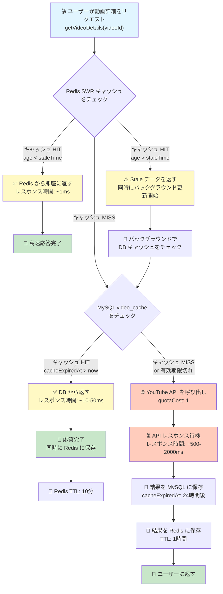

# 2層キャッシング機構のフロー



## キャッシング層の詳細

### 層1: Redis SWR キャッシュ（短期）
- **保存先**: Upstash Redis
- **TTL**: 10分～60分（データ種別による）
- **staleTime**: 5分（デフォルト）
- **更新戦略**: Stale While Revalidate
  - staleTime 経過後は古いデータを返しつつバックグラウンド更新
  - ユーザーには常に高速応答

### 層2: MySQL video_cache（長期）
- **保存先**: Manus MySQL Database
- **TTL**: 24時間
- **更新戦略**: 有効期限切れまで保持
  - 同じデータへの複数アクセスで API 呼び出しを削減
  - 24時間ごとに最新データに更新

## レスポンス時間の比較

| シナリオ | キャッシュ層 | レスポンス時間 | API 呼び出し |
|---------|-----------|-------------|-----------|
| **Redis HIT** | Layer 1 | ~1ms | ❌ なし |
| **Redis Stale** | Layer 2 | ~10-50ms | ✅ バックグラウンド |
| **DB HIT** | Layer 2 | ~10-50ms | ❌ なし |
| **キャッシュ MISS** | YouTube API | ~500-2000ms | ✅ あり |

## 実装コード例

### Redis SWR キャッシュ
```typescript
// server/swrCache.ts
export async function swrFetch<T>(
  key: string,
  fetcher: () => Promise<T>,
  options?: { ttl?: number; staleTime?: number }
): Promise<T> {
  const cached = await redis.get(key);
  
  if (cached) {
    const parsed = JSON.parse(cached);
    const age = Date.now() - parsed.updatedAt;
    
    // staleTime 経過後はバックグラウンド更新
    if (age > staleTime * 1000) {
      revalidate(key, fetcher, ttl).catch(console.error);
    }
    
    return parsed.data; // 即座に返す
  }
  
  // キャッシュなし → API 呼び出し
  const fresh = await fetcher();
  await redis.set(key, JSON.stringify({ data: fresh, updatedAt: Date.now() }), "EX", ttl);
  return fresh;
}
```

### MySQL video_cache
```typescript
// server/youtubeApi.ts
export async function getVideoDetails(videoId: string): Promise<YouTubeVideo | null> {
  // Layer 2: DB キャッシュをチェック
  const cached = await getCachedVideo(videoId);
  if (cached && cached.cacheExpiredAt > new Date()) {
    return cached; // DB から返す
  }
  
  // キャッシュなし → YouTube API を呼び出し
  const video = await fetchFromYouTubeAPI(videoId);
  
  // Layer 2: DB に保存（24時間）
  await cacheVideo({
    videoId,
    ...video,
    cacheExpiredAt: new Date(Date.now() + 24 * 60 * 60 * 1000)
  });
  
  return video;
}
```

## 現在のキャッシュ状態

### Redis に保存されているデータ
- **search**: 検索結果（30分 TTL）
- **comments**: コメント（10分 TTL）
- **details**: 動画詳細（60分 TTL）
- **related**: 関連動画（30分 TTL）

### MySQL に保存されているデータ
- **video_cache**: 動画メタデータ（24時間 TTL）
  - videoId, title, description, viewCount, likeCount, commentCount など
