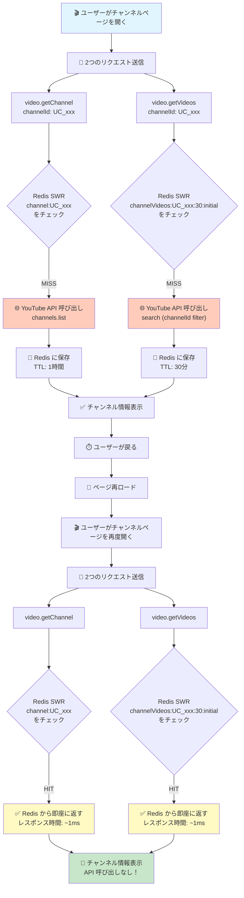

# チャンネルページ キャッシング修正後のフロー



## 修正前後の比較

### 修正前（問題あり）
```
1回目のチャンネル読み込み:
  ✅ video.getChannel → API 呼び出し
  ✅ video.getVideos → API 呼び出し
  合計: 2回の API 呼び出し

戻る → 再ロード

2回目のチャンネル読み込み:
  ✅ video.getChannel → キャッシュ HIT（API なし）
  ❌ video.getVideos → キャッシュなし（API 呼び出し）← 問題！
  合計: 1回の API 呼び出し（無駄）
```

### 修正後（最適化）
```
1回目のチャンネル読み込み:
  ✅ video.getChannel → API 呼び出し
  ✅ video.getVideos → API 呼び出し
  合計: 2回の API 呼び出し

戻る → 再ロード

2回目のチャンネル読み込み:
  ✅ video.getChannel → キャッシュ HIT（API なし）
  ✅ video.getVideos → キャッシュ HIT（API なし）← 修正！
  合計: 0回の API 呼び出し（完全最適化）
```

## キャッシング設定

| エンドポイント | キャッシュキー | TTL | staleTime |
|---------------|--------------|-----|-----------|
| `video.getChannel` | `channel:{channelId}` | 1時間 | 30分 |
| `video.getVideos` | `channelVideos:{channelId}:{maxResults}:{pageToken}` | 30分 | 15分 |

## 効果

- **API 呼び出し削減**: 同じチャンネルへの再アクセスで 100% 削減
- **レスポンス時間**: ~1ms（従来は 500-2000ms）
- **ユーザー体験**: ページ遷移が高速化
- **API クォータ節約**: 毎日のアクセスで大幅に削減
